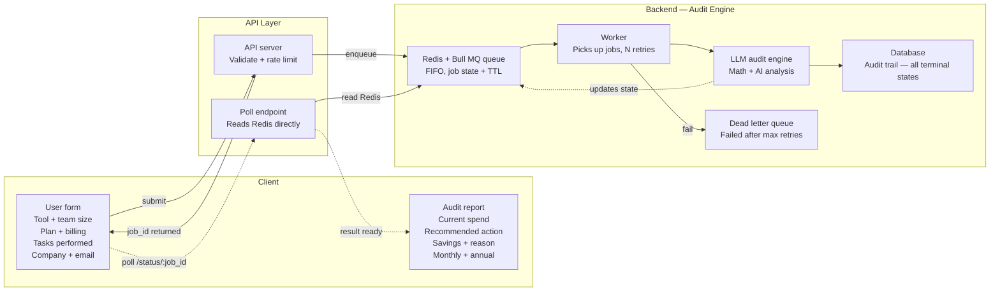

```mermaid
flowchart LR
    subgraph Client
        FORM["User form\nTool + team size\nPlan + billing\nTasks performed\nCompany + email"]
        OUT["Audit report\nCurrent spend\nRecommended action\nSavings + reason\nMonthly + annual"]
    end

    subgraph API["API Layer"]
        API_SRV["API server\nValidate + rate limit"]
        POLL["Poll endpoint\nReads Redis directly"]
    end

    subgraph Backend["Backend — Audit Engine"]
        REDIS["Redis + Bull MQ queue\nFIFO, job state + TTL"]
        WORKER["Worker\nPicks up jobs, N retries"]
        LLM["LLM audit engine\nMath + AI analysis"]
        DLQ["Dead letter queue\nFailed after max retries"]
        DB["Database\nAudit trail — all terminal states"]
    end

    FORM -->|submit| API_SRV
    API_SRV -->|job_id returned| FORM
    API_SRV -->|enqueue| REDIS
    FORM -.->|poll /status/:job_id| POLL
    POLL -->|read Redis| REDIS
    POLL -.->|result ready| OUT
    REDIS --> WORKER
    WORKER --> LLM
    LLM -.->|updates state| REDIS
    LLM --> DB
    WORKER -->|fail| DLQ
```